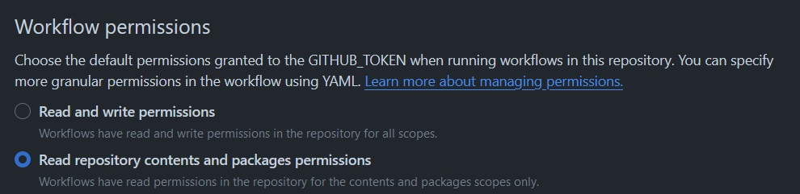

Recently I was searching for some specific docker images for my homelab. Namely something that could provide nfs v3 and some other things. I found plenty of images, but most were dated or didn't really fulfill my needs. So I thought "I'm a big boy, I can just build my own and have it on GitHub!". So I went and created a little [repo](https://github.com/furstblumier/oci), where I would put everything.

## Goals
My goals were simple: 

* I wanted one repo to start with, that houses multiple docker images
* I want a way to automate the build process
* I want my images to be publicly accessible
* If possible I also want to automate dependency updates

That last point was pretty dear to me, since that was my biggest issue looking at some other public projects. After a while the creator moved on. The images were probably fine, but after just lying there for several years, they were riddled with vulnerabilities. With that in mind, I got to work.

## Setup
Through some trial and error I went with the following structure:
```
.
├── dockerfiles
│   ├── hello
│   │   └── hello.dockerfile
│   └── nfs
│       └── nfs.dockerfile
├── .github
│   ├── dependabot.yml
│   └── workflows
│       ├── auto-merge.yml
│       └── push.yml
└── README.md
```
The folder `dockerfiles` contains sub-folders, one for each docker image I plan on building. Each subfolder contains the dockerfile and possibly needed dependencies. The meaty part of the whole setup is the automation via [GitHub-Actions](https://docs.github.com/en/actions). They allow for the automated build and push process of my images. I'll now go through the different aspects of it, starting with the build/push pipeline.

## Build/Push
The meaty part of this is the ability to create pipeline steps without keeping a hardcoded list of the folders/Dockerfiles. First I needed to find a way to run multiple jobs based on a variable. The choice here was to use a [matrix](https://docs.github.com/en/actions/using-jobs/using-a-matrix-for-your-jobs). This required a hardcoded list or something to work with, which isn't what I wanted. So I searched around and found this [blog entry](https://code.dblock.org/2021/09/03/generating-task-matrix-by-looping-over-repo-files-with-github-actions.html) which kinda did what I wanted. It's from a few years back and uses a deprecated way of generating the outputs, but the base idea still works in 2024. Let me give you a brief rundown:
```yaml
<...>
jobs:
  list-dockerfiles:
    runs-on: ubuntu-latest
    outputs:
      dockerfiles: ${{ steps.set-dockerfiles.outputs.dockerfiles }}
    steps:
      - uses: actions/checkout@v4
      - id: set-dockerfiles
        run: echo "dockerfiles=$(basename -a dockerfiles/* | jq -R -s -c 'split("\n")[:-1]')" >> $GITHUB_OUTPUT
  build:
    needs: list-dockerfiles
    runs-on: ubuntu-latest
    permissions:
      packages: write
      contents: read
    strategy:
      matrix:
        dockerfiles: ${{ fromJson(needs.list-dockerfiles.outputs.dockerfiles) }}
    # Steps represent a sequence of tasks that will be executed as part of the job
    steps:
      # Checks-out your repository under $GITHUB_WORKSPACE, so your job can access it
      - uses: actions/checkout@v4
      
      - name: Set up Docker Buildx
        uses: docker/setup-buildx-action@v3

<...>
```
I got two jobs, `list-dockerfiles` generates an output, that is based on `echo "dockerfiles=$(basename -a dockerfiles/* | jq ...` which gives me the basename of everything under `dockerfiles/*` and then writes it into a .json. This .json output is then used by the `build` job. Here we use the `matrix` strategy to iterate over `dockerfiles: ${{ fromJson(needs.list-dockerfiles.outputs.dockerfiles) }}` which is the .json we created previously. Together this means we run a job for every folder below `dockerfiles` and can generate images without having to keep a list! Pretty neat imo :3.

In order to be able to push our images we also need the permission to write packages. This is done in the github action here:

```yaml
  build:
    needs: list-dockerfiles
    runs-on: ubuntu-latest
    permissions:
      packages: write
      contents: read
```
by default the actions only have read permissions for packages. As you can see in your repository under `Settings > Actions > General`

Of course you could also just set the write permissions there. With that out of the way I just need to make my images publicly available. As it turns out this is quite annoying to do and I haven't found a way yet to do this programmatically. By default the pushed containers inherit the permissions of source repo, which is fine. It _doesn't_ inherit its visibility though. Which means you have to manually set every container to "public" or authenticate against GitHub in order to pull your containers. Let me show you an example of how to set a container to "public". First go to your repo and click on the package:

Then go to settings:

And finally scroll down to the "Danger Zone" to change the visibility to "public":

This sadly has to be done for every single Docker image, but only once. Hope they add an API endpoint for this in the future.

## Dependency Updates
To recap, so far I could check off 3 out of 4 things of my bucket list:
* I wanted one repo to start with, that houses multiple docker images ✅
* I want a way to automate the build process ✅
* I want my images to be publicly accessible ✅
* If possible I also want to automate dependency updates 🔜
This last part I setup via dependabot. First I defined the config for dependabot itself under `.github/dependabot.yml`:
```yaml
# To get started with Dependabot version updates, you'll need to specify which
# package ecosystems to update and where the package manifests are located.
# Please see the documentation for all configuration options:
# https://docs.github.com/code-security/dependabot/dependabot-version-updates/configuration-options-for-the-dependabot.yml-file

version: 2
updates: 
  # Enable version updates for Docker
  - package-ecosystem: "docker"
    # Look for a `Dockerfile` in the `root` directory
    # wait til https://github.com/dependabot/dependabot-core/issues/2178 is fixed
    directory: "/dockerfiles/hello"
    # Check for updates once a week
    schedule:
      interval: "weekly"
  # Maintain dependencies for GitHub Actions
  - package-ecosystem: "github-actions"
    # Workflow files stored in the default location of `.github/workflows`. (You don't need to specify `/.github/workflows` for `directory`. You can use `directory: "/"`.)
    directory: "/"
    schedule:
      interval: "weekly"
```
Sadly it's not yet possible to define a wildcard for the containers it is supposed to update, but it sounds like they are now working on this feature. Keep an eye on the [issue](https://github.com/dependabot/dependabot-core/issues/2178). This definition will make dependabot scan the repo once a week and then create PRs if there are things that should be updated. These PRs have to be approved and merged. But we can go a step further to also automate this step. Under `.github/workflows/auto-merge.yml` I defined yet another workflow:
```yaml
name: Dependabot auto-merge
on: pull_request

permissions:
  contents: write
  pull-requests: write

jobs:
  dependabot:
    runs-on: ubuntu-latest
    if: github.actor == 'dependabot[bot]'
    steps:
      - name: Dependabot metadata
        id: metadata
        uses: dependabot/fetch-metadata@v1
        with:
          github-token: "${{ secrets.GITHUB_TOKEN }}"
      - name: Enable auto-merge for Dependabot PRs
        if: (contains(steps.metadata.outputs.package-ecosystem, 'docker') || contains(steps.metadata.outputs.package-ecosystem, 'github-actions')) && steps.metadata.outputs.update-type == 'version-update:semver-patch'
        run: gh pr merge --auto --squash "$PR_URL"
        env:
          PR_URL: ${{github.event.pull_request.html_url}}
          GH_TOKEN: ${{secrets.GITHUB_TOKEN}}
```
which is based on [this](https://docs.github.com/en/code-security/dependabot/working-with-dependabot/automating-dependabot-with-github-actions#enable-auto-merge-on-a-pull-request). Keep in mind that you should also have protection rules in place if you wanna have this feature, else you might automatically push a broken container.

## Conclusion
As you can see it's a bit of setup but fairly doable to have a low maintenance docker repo. Biggest issue so far is the visibility settings and dependabot definition which both hopefully will be fixed in the future to be able to 100% automate the whole workflow.