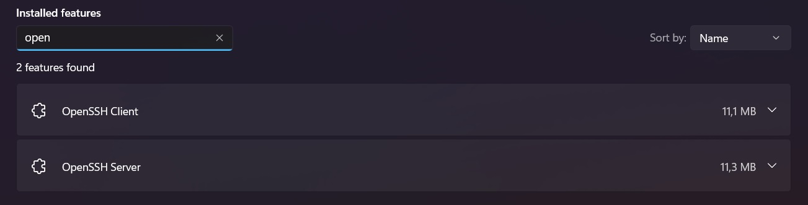
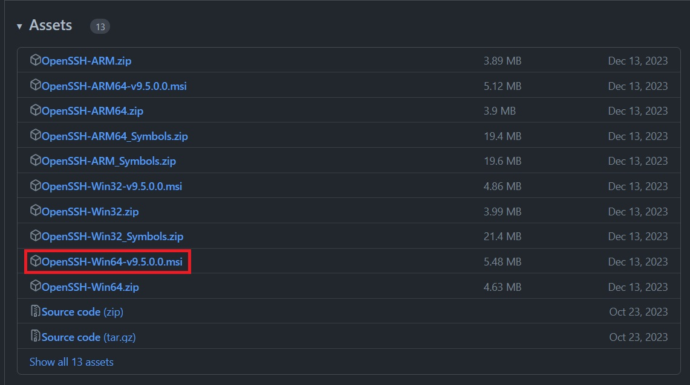

Yubikeys are pretty great and I've seen a lot of people (either privately or professionally) use them for passwordless authentication and a bunch of other things. What's also kinda known is the possibility to use them for ssh via PIV. For that to work you usually have to implement some kind of bridge that exposes the key via PCKS11. One of the newer ways that also just works&trade; natively under Linux (or here, Windows) is FIDO2/U2F based authentication. Since I've seen very little about this topic, I wanted to share my experience.

## Installing ssh on windows
Windows has built-in ssh capabilities in the form of a port of [OpenBSD's OpenSSH](https://www.openssh.com/). First you'll have to enable this feature on Windows though. Under Windows 11 navigate to System > Optional features > Add an optional feature. In the search bar search for "SSH" and you should see 2 options: "OpenSSH Client" and "OpenSSH Server". Add at least the client feature. If you also enable the server component, Windows usually also opens port 22 in its firewall. That makes your PC reachable via ssh, with all advantages and disadvantages :3. _Just be aware what enabling a SSH Server means._ If everything got set up correctly, you should be able to find the features by just searching for them:

If you now open a terminal of your choice, you can enter `ssh -V` and see that you have indeed an OpenSSH client. The version that is bundled with windows is sadly too old to use FIDO2/U2F based keys. You will need at least version `V8.9.0.0p1`. So now we will have to update it. The easiest way to do that is via `winget`. Run the terminal as admin and `winget search "openssh beta"` allows to search for a beta version, while `winget install "openssh beta"` installs it. Alternatively download the .msi of a [release](https://github.com/PowerShell/Win32-OpenSSH/releases) of your choice, e.g.

Afterwards start a terminal as admin and run
```batch
msiexec /i <path to openssh.msi>
```
To install the client AND server. This has to be the absolute path to the .msi, relative paths didn't work for me. So something like
```batch
msiexec /i C:\Users\furst\Downloads\OpenSSH-Win64-v9.5.0.0.msi
```
If you want to install only the client or only the server you need to pass `ADDLOCAL=Client` or `ADDLOCAL=Server` as arguments respectively. E.g.
```batch
msiexec /i C:\Users\furst\Downloads\OpenSSH-Win64-v9.5.0.0.msi ADDLOCAL=Client
```
To check if everything worked, run `ssh -V` and see if the version is updated:

Congrats! Now you can generate FIDO2 based ssh-keys.

## Generating the keys
Now with the grunt-work being done, we can actually generate the keys. Before you generate one you should think about what kind of "flavor" you want. Generally there are 4 different possibilities to set your ssh-key up:

Variant | Description | Arguments
---|---|---
Neither PIN nor touch | Having the Yubikey in your usb port is enough to authenticate | `-O resident -O no-touch-required`
PIN but no touch | You'll have to enter your FIDO2 PIN to authenticate | `-O resident -O verify-required -O no-touch-required`
Touch but no PIN | You'll have to touch your Yubikey to authenticate | `-O resident`
PIN and touch (recommended) | You'll have to enter your FIDO2 PIN and touch the key to authenticate | `-O resident -O verify-required`

If you pick one of the FIDO2 PIN variants, make sure to set this PIN first via the [Yubikey Manager](https://www.yubico.com/support/download/yubikey-manager/#h-downloads). Then you need to pick which kind of ssh-key you want to generate: `ecdsa-sk` or `ed25519-sk`. `ed25519-sk` is more "modern" but needs a more recent version of ssh to be supported. If `ed25519-sk` doesn't work, pick `ecdsa-sk`. With that out of the way you can e.g. run
```batch
ssh-keygen -t ed25519-sk -O resident -O verify-required -O application=ssh:YourTextHere
```
the `-O application=ssh:YourTextHere` bit is to give you the possibility to tag the key in some way, to know which key is for what. For example `-O application=ssh:Github`.
Afterwards a few windows will pop open which you will have to answer with "ok". If you enabled the PIN based verification, you will also be prompted to enter the PIN. Afterwards you get the usual questions about where to save your key and if you want to password protect the key itself too. Et voilà, you are done! You should now have an `id_ed25519_sk` and `id_ed25519_sk.pub` file in your .ssh folder (or wherever you put it). These can now be used like normal ssh-keys.

## Sources
* https://developers.yubico.com/SSH/Securing_SSH_with_FIDO2.html
* https://gist.github.com/Kranzes/be4fffba5da3799ee93134dc68a4c67b#evaluating-additional-authentication-factors
* https://github.com/PowerShell/Win32-OpenSSH/wiki/Install-Win32-OpenSSH