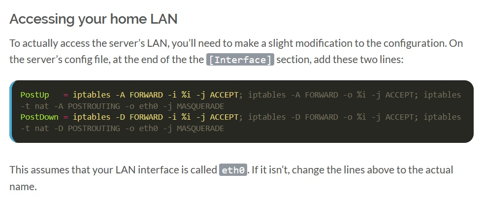

Like many, I also jumped on-board and got one of Oracle Cloud's [Ampere A1 flex instances](https://docs.oracle.com/en-us/iaas/Content/FreeTier/freetier_topic-Always_Free_Resources.htm#freetier_topic_Always_Free_Resources_Infrastructure) a while ago. The ability to split it up into e.g. 4 machines at no cost is pretty amazing, even if you hate Oracle. I used one machine standalone, while my other 3 formed a Kubernetes cluster, which might become a topic for another blog entry in the future. Anyway I'll skip out on how to setup your cloud instance and how to setup Wireguard. There are already a million guides out there for either topic.

## The setup
So essentially I had my client PC in my home network and I had a cloud machine that will serve as the VPN server. Said cloud machine also got a public (static) IPv4. Since it's been a while since I used Wireguard the last time I followed [this blog entry](https://www.stavros.io/posts/how-to-configure-wireguard/), which helped me a lot to get everything working. I also set the "PostUp" and "PostDown" as they described:

To test my connection I ran `curl ifconfig.me` to see if the public IP I got in the reply matched the IP of my home connection, or the public IPv4 from Oracle. But when I ran it on my client I saw that I just got a timeout, which confused me greatly. My server config looked like this:
```conf
[Interface]
Address = 192.168.2.1
PrivateKey = <server private key>
ListenPort = 51820
PostUp   = iptables -A FORWARD -i %i -j ACCEPT; iptables -A FORWARD -o %i -j ACCEPT; iptables -t nat -A POSTROUTING -o enp0s6 -j MASQUERADE
PostDown = iptables -D FORWARD -i %i -j ACCEPT; iptables -D FORWARD -o %i -j ACCEPT; iptables -t nat -D POSTROUTING -o enp0s6 -j MASQUERADE

[Peer]
PublicKey = <client public key>
AllowedIPs = 192.168.2.2/32
```
Like the blog entry told me. I also made sure to run `sysctl -w net.ipv4.ip_forward=1` in order forward my IPv4 traffic. Next I tried to figure out if my client even reached my server. For that I ran `watch iptables -L INPUT -nvx` and turned the wg interface off and on again on the client side. I saw the following:
```
Chain INPUT (policy ACCEPT 0 packets, 0 bytes)
    pkts      bytes target     prot opt in     out     source               destination         
 1862709 154764002 ACCEPT     all  --  *      *       0.0.0.0/0            0.0.0.0/0            state RELATED,ESTABLISHED
       1      576 ACCEPT     icmp --  *      *       0.0.0.0/0            0.0.0.0/0           
     910    74058 ACCEPT     all  --  lo     *       0.0.0.0/0            0.0.0.0/0           
       0        0 ACCEPT     udp  --  *      *       0.0.0.0/0            0.0.0.0/0            udp spt:123
   13606   811557 ACCEPT     tcp  --  *      *       0.0.0.0/0            0.0.0.0/0            state NEW tcp dpt:22
       9     1352 ACCEPT     udp  --  *      *       0.0.0.0/0            0.0.0.0/0            state NEW udp dpt:51820
     714    85461 REJECT     all  --  *      *       0.0.0.0/0            0.0.0.0/0            reject-with icmp-host-prohibited
```
So I got 9 connection attempts at least, which told me it at least reached my server. So next I checked my iptables FORWARD rules via `watch iptables -L FORWARD -nvx` and immediately saw my mistake:
```
Chain FORWARD (policy DROP 0 packets, 0 bytes)
    pkts      bytes target     prot opt in     out     source               destination         
      68     6195 DOCKER-USER  all  --  *      *       0.0.0.0/0            0.0.0.0/0           
      68     6195 DOCKER-ISOLATION-STAGE-1  all  --  *      *       0.0.0.0/0            0.0.0.0/0           
       0        0 ACCEPT     all  --  *      docker0  0.0.0.0/0            0.0.0.0/0            ctstate RELATED,ESTABLISHED
       0        0 DOCKER     all  --  *      docker0  0.0.0.0/0            0.0.0.0/0           
       0        0 ACCEPT     all  --  docker0 !docker0  0.0.0.0/0            0.0.0.0/0           
       0        0 ACCEPT     all  --  docker0 docker0  0.0.0.0/0            0.0.0.0/0           
       0        0 REJECT     all  --  *      *       0.0.0.0/0            0.0.0.0/0            reject-with icmp-host-prohibited
       0        0 ACCEPT     all  --  *      wg0     0.0.0.0/0            0.0.0.0/0           
       0        0 ACCEPT     all  --  wg0    *       0.0.0.0/0            0.0.0.0/0           
```
The "PostUp" and "PostDown" were written with `-A` so they got appended _after_ the "drop all" rule that Oracle has by default. Facepaw.
Once I saw that I changed the `wg0.conf` like this:
```conf
[Interface]
Address = 192.168.2.1
PrivateKey = <server private key>
ListenPort = 51820
PostUp   = iptables -I FORWARD 6 -i %i -j ACCEPT; iptables -I FORWARD 6 -o %i -j ACCEPT; iptables -t nat -A POSTROUTING -o enp0s6 -j MASQUERADE
PostDown = iptables -D FORWARD -i %i -j ACCEPT; iptables -D FORWARD -o %i -j ACCEPT; iptables -t nat -D POSTROUTING -o enp0s6 -j MASQUERADE

[Peer]
PublicKey = <client public key>
AllowedIPs = 192.168.2.2/32
```
to insert the rule at position #6 instead of appending it. Which changed my FORWARD chain to:
```
Chain FORWARD (policy DROP 0 packets, 0 bytes)
    pkts      bytes target     prot opt in     out     source               destination         
      68     6195 DOCKER-USER  all  --  *      *       0.0.0.0/0            0.0.0.0/0           
      68     6195 DOCKER-ISOLATION-STAGE-1  all  --  *      *       0.0.0.0/0            0.0.0.0/0           
       0        0 ACCEPT     all  --  *      docker0  0.0.0.0/0            0.0.0.0/0            ctstate RELATED,ESTABLISHED
       0        0 DOCKER     all  --  *      docker0  0.0.0.0/0            0.0.0.0/0           
       0        0 ACCEPT     all  --  docker0 !docker0  0.0.0.0/0            0.0.0.0/0           
      16     1592 ACCEPT     all  --  *      wg0     0.0.0.0/0            0.0.0.0/0           
      24     1576 ACCEPT     all  --  wg0    *       0.0.0.0/0            0.0.0.0/0           
       0        0 ACCEPT     all  --  docker0 docker0  0.0.0.0/0            0.0.0.0/0           
       0        0 REJECT     all  --  *      *       0.0.0.0/0            0.0.0.0/0            reject-with icmp-host-prohibited
```
And it worked! Morale of the story: always be aware of how (stupidly) restrictive Oracle's compute instances are by default :'3.